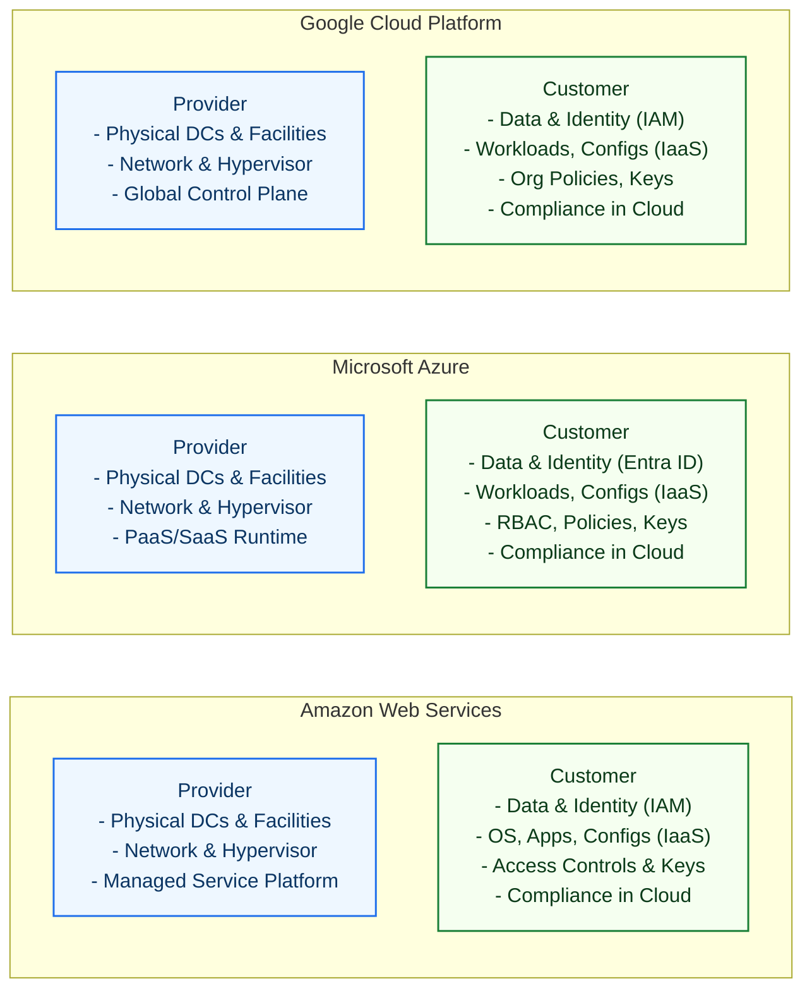

```mermaid
flowchart LR
    %% Shared Responsibility: Provider vs Customer (AWS, Azure, GCP)
    subgraph AWS[Amazon Web Services]
        AProv["Provider
        - Physical DCs & Facilities
        - Network & Hypervisor
        - Managed Service Platform"]:::prov
        ACust["Customer
        - Data & Identity (IAM)
        - OS, Apps, Configs (IaaS)
        - Access Controls & Keys
        - Compliance in Cloud"]:::cust
    end
    subgraph AZ[Microsoft Azure]
        ZProv["Provider
        - Physical DCs & Facilities
        - Network & Hypervisor
        - PaaS/SaaS Runtime"]:::prov
        ZCust["Customer
        - Data & Identity (Entra ID)
        - Workloads, Configs (IaaS)
        - RBAC, Policies, Keys
        - Compliance in Cloud"]:::cust
    end
    subgraph GCP[Google Cloud Platform]
        GProv["Provider
        - Physical DCs & Facilities
        - Network & Hypervisor
        - Global Control Plane"]:::prov
        GCust["Customer
        - Data & Identity (IAM)
        - Workloads, Configs (IaaS)
        - Org Policies, Keys
        - Compliance in Cloud"]:::cust
    end
    classDef prov fill:#eef7ff,stroke:#1f6feb,stroke-width:1.5px,color:#0b3563
    classDef cust fill:#f5fff0,stroke:#1a7f37,stroke-width:1.5px,color:#0b3b19
```
