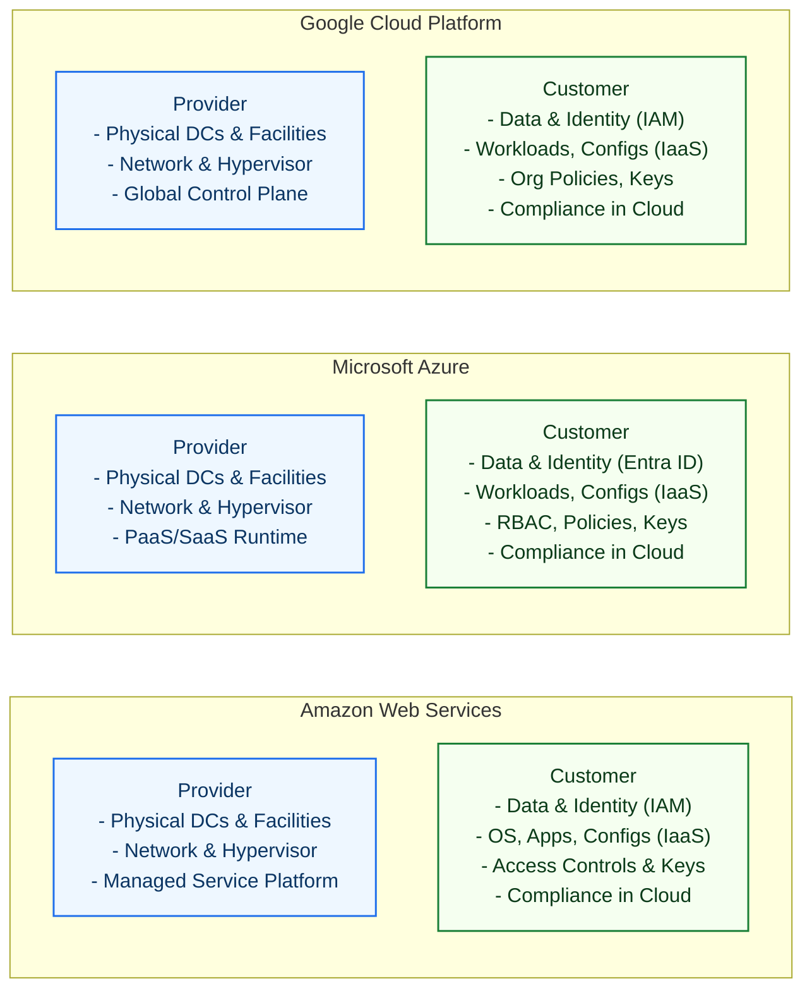

```mermaid
flowchart LR
    %% Shared Responsibility: Provider vs Customer (AWS, Azure, GCP)
    subgraph AWS[Amazon Web Services]
        AProv["Provider<br/>- Physical DCs & Facilities<br/>- Network & Hypervisor<br/>- Managed Service Platform"]:::prov
        ACust["Customer<br/>- Data & Identity (IAM)<br/>- OS, Apps, Configs (IaaS)<br/>- Access Controls & Keys<br/>- Compliance in Cloud"]:::cust
    end
    
    subgraph AZ[Microsoft Azure]
        ZProv["Provider<br/>- Physical DCs & Facilities<br/>- Network & Hypervisor<br/>- PaaS/SaaS Runtime"]:::prov
        ZCust["Customer<br/>- Data & Identity (Entra ID)<br/>- Workloads, Configs (IaaS)<br/>- RBAC, Policies, Keys<br/>- Compliance in Cloud"]:::cust
    end
    
    subgraph GCP[Google Cloud Platform]
        GProv["Provider<br/>- Physical DCs & Facilities<br/>- Network & Hypervisor<br/>- Global Control Plane"]:::prov
        GCust["Customer<br/>- Data & Identity (IAM)<br/>- Workloads, Configs (IaaS)<br/>- Org Policies, Keys<br/>- Compliance in Cloud"]:::cust
    end
    
    classDef prov fill:#eef7ff,stroke:#1f6feb,stroke-width:1.5px,color:#0b3563
    classDef cust fill:#f5fff0,stroke:#1a7f37,stroke-width:1.5px,color:#0b3b19
```
